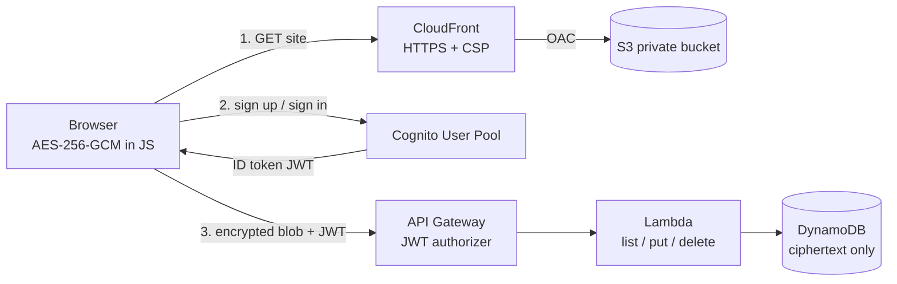
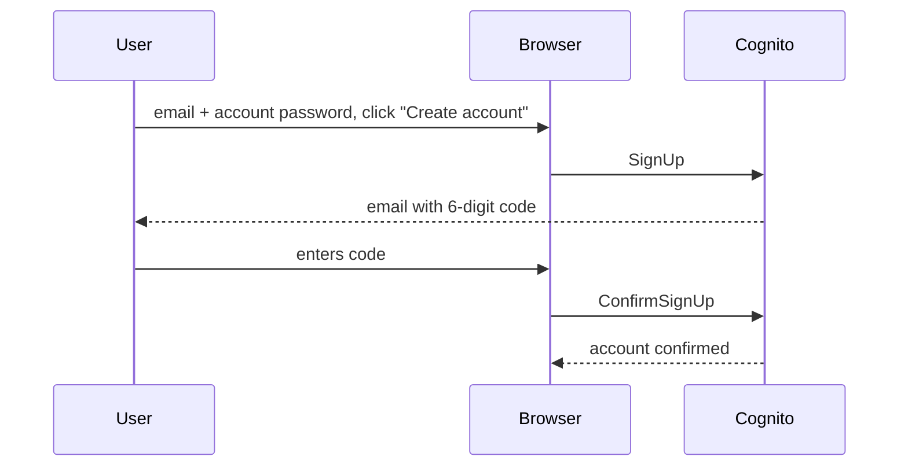
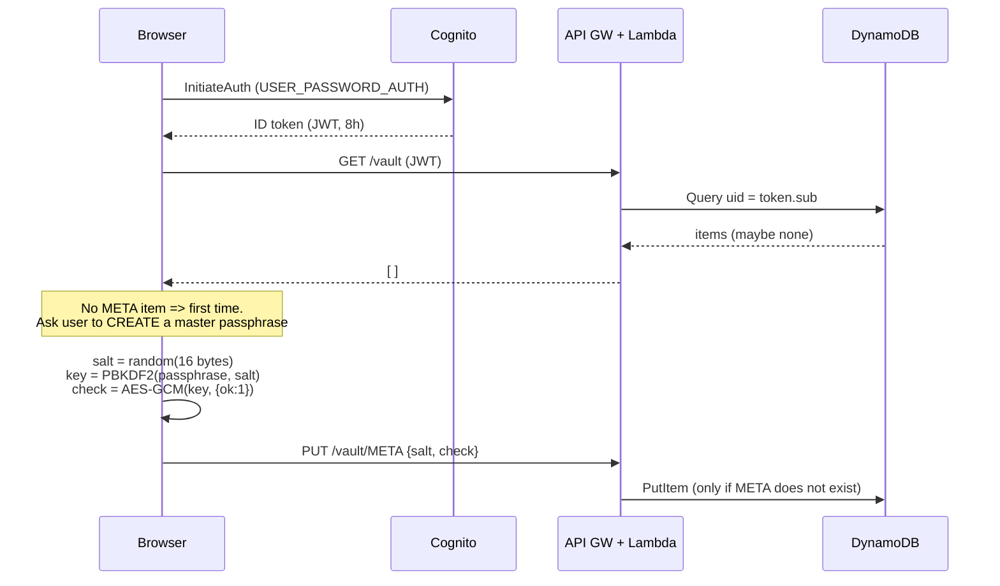

# CloudVault: A Zero-Knowledge Cloud Password Vault on AWS

**Project topic:** Cloud Password Vault (Batch A1-4)
**Department:** Information Science and Engineering
**Cloud provider:** Amazon Web Services (AWS)
**Delivery model:** Fully hosted, serverless, and defined as Infrastructure as Code

> This document is written so that sections can be lifted directly into the project report. Each numbered section is self-contained. Sections 6 to 10 are the technical core. Section 18 has likely viva questions with answers.

---

## Table of contents

1. [Abstract](#1-abstract)
2. [Introduction and problem statement](#2-introduction-and-problem-statement)
3. [Objectives](#3-objectives)
4. [Requirements and scope](#4-requirements-and-scope)
5. [Technology choices and justification](#5-technology-choices-and-justification)
6. [System architecture](#6-system-architecture)
7. [Detailed workflows](#7-detailed-workflows)
8. [Cryptographic design](#8-cryptographic-design)
9. [Data model](#9-data-model)
10. [API specification](#10-api-specification)
11. [Infrastructure as Code walk-through](#11-infrastructure-as-code-walk-through)
12. [Frontend design](#12-frontend-design)
13. [Security analysis](#13-security-analysis)
14. [Cloud computing characteristics demonstrated](#14-cloud-computing-characteristics-demonstrated)
15. [Cost analysis](#15-cost-analysis)
16. [Testing](#16-testing)
17. [Limitations and future work](#17-limitations-and-future-work)
18. [Viva questions and answers](#18-viva-questions-and-answers)
19. [Glossary](#19-glossary)
20. [Repository structure](#20-repository-structure)
21. [References](#21-references)

---

## 1. Abstract

CloudVault is a web-based password manager that is hosted entirely on AWS. Users register with an email address and password, then store website credentials in a personal dashboard. Every credential is **encrypted in the user's browser with AES-256-GCM before it leaves the device**. The key is derived from a *master passphrase* that is never transmitted. As a result, the cloud provider, the application operator and anyone who breaches the database sees only unreadable ciphertext. This property is called **zero-knowledge** or **client-side end-to-end encryption**.

The system is built from managed, serverless AWS services: Amazon S3 and CloudFront host the web app, Amazon Cognito handles identity, Amazon API Gateway and AWS Lambda provide the API, and Amazon DynamoDB stores the encrypted data. The entire infrastructure is declared in a single CloudFormation template and deployed with one command. It has no servers to patch, scales automatically, and costs close to nothing at low usage.

## 2. Introduction and problem statement

### 2.1 Background

The average person has dozens or hundreds of online accounts. Users cope by reusing passwords or choosing memorable ones, and both habits are the leading cause of account takeovers. Password managers solve this by generating and storing a unique strong password for every site, so that the user remembers only one secret.

### 2.2 Problem

Storing a user's passwords on a server creates a very attractive target. If the server holds passwords in readable form (or encrypted with a key the server also holds), then one breach, one malicious insider or one misconfigured cloud bucket exposes everything. Past breaches of password-manager vendors have shown that this risk is real.

### 2.3 Why managed cloud services alone are not the answer

Services such as **AWS Secrets Manager**, **AWS Systems Manager Parameter Store**, **Google Secret Manager** and **Azure Key Vault** are designed to store secrets for *applications* (database passwords, API keys), accessed by software through IAM roles. They are not password managers for *people*: they have no end-user sign-up, no per-user vault, no dashboard, and the cloud provider can technically read the values. A human-facing vault that the provider cannot read has to be built on top of general-purpose managed services, with encryption done by the client. That is what this project does.

### 2.4 Proposed solution

A serverless application in which:
- identity is delegated to a managed identity service (Cognito),
- the browser performs all encryption and decryption,
- the cloud only stores and returns opaque encrypted blobs, and
- every request is authenticated and scoped to the calling user.

## 3. Objectives

1. Provide secure user registration and login using a managed identity service.
2. Provide a dashboard to add, view, search, copy and delete stored credentials.
3. **Guarantee that the cloud provider cannot learn any stored password** by encrypting on the client before upload.
4. Return the correct plaintext to an authenticated user who supplies the right master passphrase.
5. Host the entire application on AWS with **no local server**, and reproduce the deployment with one command (Infrastructure as Code).
6. Keep the design simple, low-cost and easy to explain, and demonstrate core cloud computing concepts along the way.

## 4. Requirements and scope

### 4.1 Functional requirements

| ID | Requirement | Where it is implemented |
|---|---|---|
| F1 | A user can register with email and password | Cognito `SignUp`, `web/app.js` |
| F2 | Email ownership is verified with a one-time code | Cognito `ConfirmSignUp` |
| F3 | A user can sign in and sign out | Cognito `InitiateAuth`, `signOut()` |
| F4 | A user sets a master passphrase on first use | `unlock` form, `deriveKey()` |
| F5 | A user can add a credential (site, username, password) | `add` form, `PUT /vault/{id}` |
| F6 | A user can list and search their credentials | `GET /vault`, `render()` |
| F7 | A user can reveal and copy a password | `Show` and `Copy` buttons |
| F8 | A user can delete a credential | `DELETE /vault/{id}` |
| F9 | A user can generate a random strong password | `gen` button |
| F10 | Data is encrypted before leaving the browser | `web/crypto.js` |

### 4.2 Non-functional requirements

| Category | Requirement | How it is met |
|---|---|---|
| Security | Provider cannot read passwords | Client-side AES-256-GCM, key never sent |
| Security | One user can never read another's data | JWT authorizer plus partition key equal to the token's `sub` |
| Availability | No single server to fail | Serverless, multi-AZ managed services |
| Scalability | Handle growth with no changes | On-demand DynamoDB, Lambda concurrency, CloudFront |
| Cost | Near zero at low usage | Pay-per-request pricing everywhere |
| Maintainability | Reproducible, reviewable | One CloudFormation template, one deploy script |
| Usability | Works in any modern browser | Plain HTML, CSS and JavaScript, no install |

### 4.3 Scope boundaries (deliberately excluded)

Password recovery, multi-factor authentication, sharing between users, browser-extension autofill, file attachments, mobile apps and a custom domain are out of scope. They are discussed in [Section 17](#17-limitations-and-future-work).

## 5. Technology choices and justification

### 5.1 AWS services used

| Service | Role | Why this service | Alternative considered |
|---|---|---|---|
| **Amazon S3** | Stores the static site files | Cheapest, most durable file hosting (11 nines durability) | EC2 web server: costs more, needs patching |
| **Amazon CloudFront** | HTTPS CDN in front of S3 | Free TLS certificate on `*.cloudfront.net`. **HTTPS is mandatory**, because the browser's Web Crypto API only works in secure contexts. Also provides security headers and global caching. | S3 website hosting: HTTP only, so crypto would not work |
| **Amazon Cognito (User Pool)** | Registration, email verification, login, token issuing | Handles the hardest and riskiest part (credential storage, brute-force protection, verification flows) so we do not write it ourselves | Custom auth in Lambda: error-prone and insecure by default |
| **Amazon API Gateway (HTTP API)** | Public REST endpoint with a built-in JWT authorizer | Validates Cognito tokens **before** any code runs. HTTP APIs are cheaper and simpler than REST APIs. | REST API: more features not needed here |
| **AWS Lambda (Node.js 22)** | Three tiny operations: list, put, delete | No servers; pay only per request; scales to zero | ECS/EC2: always-on cost |
| **Amazon DynamoDB** | Stores the encrypted blobs | Serverless NoSQL, single-digit-millisecond reads, on-demand billing, point-in-time recovery | RDS: always-on instance and cost |
| **AWS CloudFormation** | Defines all of the above as code | Repeatable, auditable, one-command deploy and teardown | Terraform/CDK: need extra tooling |
| **AWS CloudShell** | Browser-based terminal used to deploy | No local setup for whoever owns the AWS account | Local AWS CLI: needs installing and credentials |
| **IAM** | Least-privilege role for the Lambda | Function can only `Query`, `PutItem` and `DeleteItem` on **one** table | n/a |

### 5.2 Why no frontend framework or SDK

The browser app is about 150 lines of plain JavaScript with **zero dependencies**:
- encryption uses the built-in **Web Crypto API**,
- Cognito is called over its documented HTTPS JSON API with `fetch`, and
- the UI is built with the DOM.

For a security product this is a feature. There is no `node_modules` supply-chain risk, there is no build step, and the whole code base can be read in ten minutes. It also lets the Content-Security-Policy be very strict (`default-src 'self'`).

### 5.3 Why separate the account password from the master passphrase

Cognito needs the account password in order to authenticate you, so the cloud sees it (over TLS) at login. If the encryption key were derived from the same password, the provider could in principle derive the key. Using a **second secret, the master passphrase, that is never transmitted** keeps the zero-knowledge guarantee honest. See [Section 8](#8-cryptographic-design).

## 6. System architecture

### 6.1 High-level diagram

```
                       ┌──────────────────────────── USER'S BROWSER ────────────────────────────┐
                       │  index.html / app.js / crypto.js                                       │
                       │   • master passphrase ──PBKDF2──► AES-256 key (stays in memory only)   │
                       │   • encrypt() / decrypt() happen HERE                                  │
                       └───────┬───────────────────────┬───────────────────────┬────────────────┘
                  (1) load site│       (2) sign up /   │          (3) encrypted│blobs + JWT
                               │           sign in     │                       │
                               ▼                       ▼                       ▼
                       ┌──────────────┐        ┌──────────────┐        ┌────────────────┐
                       │  CloudFront  │        │   Cognito    │        │  API Gateway   │
                       │ HTTPS + CSP  │        │  User Pool   │        │ (HTTP API)     │
                       └──────┬───────┘        └──────┬───────┘        │ JWT authorizer │◄── validates token
                              │ OAC (private)         │ issues         └───────┬────────┘    with Cognito keys
                              ▼                       │ ID token (JWT)         │ only valid calls pass
                       ┌──────────────┐               └────────────────────────┤
                       │  S3 bucket   │                                        ▼
                       │ (static site)│                                ┌───────────────┐
                       └──────────────┘                                │    Lambda     │
                                                                       │ list/put/del  │
                                                                       └───────┬───────┘
                                                                               ▼
                                                                       ┌───────────────┐
                                                                       │   DynamoDB    │
                                                                       │ ciphertext    │
                                                                       │ only          │
                                                                       └───────────────┘
```

### 6.2 Same architecture in Mermaid



### 6.3 Trust boundaries

| Component | Sees plaintext passwords? | Sees master passphrase? | Sees account password? |
|---|---|---|---|
| Browser | Yes (needs to) | Yes (needs to) | Yes |
| CloudFront / S3 | No | No | No |
| Cognito | No | **No** | Yes (that is its job) |
| API Gateway | No | No | No (sees the JWT only) |
| Lambda | **No**, sees ciphertext | No | No |
| DynamoDB | **No**, stores ciphertext | No | No |
| AWS employees / a database breach | **No** | No | No (Cognito stores it protected) |

The key point is the shaded boundary: **everything to the right of the browser is untrusted with respect to secrecy**. Even a complete compromise of the Lambda or the database yields only ciphertext.

### 6.4 Request path summary

| Step | Browser talks to | Protocol | Authenticated by |
|---|---|---|---|
| Load the app | CloudFront | HTTPS | none (public static files) |
| Register / log in | `cognito-idp.<region>.amazonaws.com` | HTTPS JSON | account password |
| Any vault operation | API Gateway | HTTPS | `Authorization: <Cognito ID token>` |

## 7. Detailed workflows

### 7.1 Registration



### 7.2 Login and first-time vault creation



The `check` value is a tiny encrypted marker. On later logins, if decrypting it succeeds, the passphrase is correct. Without it the app could not tell a wrong passphrase from a corrupted blob. The server cannot decrypt it, so it learns nothing about the passphrase.

### 7.3 Normal login (returning user)

1. Browser authenticates with Cognito and receives a JWT.
2. Browser calls `GET /vault`. The response includes `META` (salt and check value) and all encrypted entries.
3. The user types the master passphrase. The browser derives the key with the stored salt and attempts to decrypt `check`.
   - **Success:** the key is kept in memory and all entries are decrypted and displayed.
   - **Failure:** "Wrong master passphrase". Nothing is revealed. Guesses are limited only by PBKDF2 cost, so see [Section 13](#13-security-analysis).

### 7.4 Add an entry

1. The user fills in site, username and password.
2. The browser builds `{site, user, pass}`, generates a fresh random 12-byte IV, and encrypts with AES-256-GCM.
3. The browser sends `PUT /vault/E-<uuid>` with body `{iv, ct}`.
4. The API Gateway authorizer validates the JWT. The Lambda stores the body as an opaque string under `(uid = sub, id = E-<uuid>)`.

### 7.5 Retrieve and view entries

`GET /vault` returns every blob that belongs to the caller. The browser decrypts each one locally. A wrong key makes GCM authentication fail, so the user sees an error rather than garbage.

### 7.6 Delete an entry

`DELETE /vault/E-<uuid>`. The Lambda deletes the item with key `(uid = sub, id)`. Because `uid` comes from the **verified token** and not from the request, a user cannot delete someone else's data even by guessing an id.

### 7.7 Lock and sign out

The encryption key and decrypted entries exist only in JavaScript variables. Signing out, closing the tab, or refreshing the page clears them. The next use requires signing in and entering the passphrase again.

## 8. Cryptographic design

### 8.1 Goal

> Even with full read access to every AWS resource in the account, an attacker must not be able to recover any stored username, password or site name without guessing the user's master passphrase.

### 8.2 Primitives and parameters

| Purpose | Choice | Parameters | Standard |
|---|---|---|---|
| Key derivation | **PBKDF2-HMAC-SHA-256** | 600,000 iterations, 16-byte random salt | RFC 8018; NIST SP 800-132; OWASP Password Storage Cheat Sheet recommendation |
| Encryption | **AES-256-GCM** | 256-bit key, 96-bit random IV per message, 128-bit tag | NIST SP 800-38D |
| Randomness | `crypto.getRandomValues` | CSPRNG from the OS | W3C Web Crypto |
| Implementation | Browser **Web Crypto API** | Native, audited, non-extractable `CryptoKey` | W3C Web Crypto |

### 8.3 Why these choices

- **PBKDF2 with a high iteration count** deliberately makes each passphrase guess slow (a fraction of a second), so an attacker with stolen ciphertext cannot test billions of guesses per second. It is available natively in every browser, so no library is needed. Argon2id is stronger against GPUs but would need a third-party WebAssembly library. That trade-off is noted in future work.
- **AES-GCM** is an *authenticated* mode. It provides confidentiality **and** integrity. If anyone modifies the stored ciphertext, decryption fails instead of returning altered data.
- **A fresh random IV per encryption** is mandatory for GCM. Reusing an IV with the same key would be catastrophic. With 96-bit random IVs the collision probability is negligible for the number of messages in a personal vault.
- **A per-user random salt** makes identical passphrases produce different keys, and defeats precomputed (rainbow) tables.
- **Non-extractable key:** the derived `CryptoKey` is created with `extractable = false`, so even script running in the page cannot read the raw key bytes. It can only ask the browser to use the key.

### 8.4 What gets encrypted

The **whole entry** `{site, user, pass}` is serialised to JSON and encrypted as one unit. This hides site names and usernames too, not only passwords. The server sees only:

```json
{ "uid": "<cognito sub>", "id": "E-3f1c…", "blob": "{\"iv\":\"…\",\"ct\":\"…\"}" }
```

### 8.5 Algorithm in pseudocode

```
FIRST USE
  salt  ← random(16 bytes)
  key   ← PBKDF2-SHA256(masterPassphrase, salt, 600000) → 256 bits
  check ← AES-GCM-Encrypt(key, iv₀, {"ok":1})
  upload  META = { salt, check }

ADD ENTRY
  iv   ← random(12 bytes)
  ct   ← AES-GCM-Encrypt(key, iv, JSON({site,user,pass}))
  upload  E-uuid = { iv, ct }

UNLOCK
  download META, entries
  key ← PBKDF2-SHA256(masterPassphrase, META.salt, 600000)
  if AES-GCM-Decrypt(key, META.check) fails → "wrong passphrase"
  for each entry: plaintext ← AES-GCM-Decrypt(key, entry)   // auth tag verified
```

### 8.6 What the server can and cannot learn

| Server can learn | Server cannot learn |
|---|---|
| That a user exists (email, from Cognito) | Any site, username or password |
| How many entries a user has | The master passphrase |
| Approximate size of each entry | The encryption key |
| When entries were written | Whether two entries share a password |

### 8.7 Unrecoverable by design

Because the key exists only in the user's head and browser, **nobody can reset or recover a forgotten master passphrase**, including the project owner and AWS. The UI warns the user at creation time. This is the inherent trade-off of zero-knowledge systems and is something every serious password manager (Bitwarden, 1Password) also documents.

## 9. Data model

### 9.1 Table: single DynamoDB table

| Attribute | Type | Role |
|---|---|---|
| `uid` | String | **Partition key.** The Cognito user id (`sub` claim), a UUID |
| `id` | String | **Sort key.** `META` or `E-<uuid>` |
| `blob` | String | Opaque string uploaded by the client |

Billing mode is **on-demand** (`PAY_PER_REQUEST`). Point-in-time recovery is on. Server-side encryption at rest is on (AWS KMS managed key), which is a second layer *under* the client-side encryption.

### 9.2 Example contents

```
uid=9a1c…  id=META        blob={"salt":"q3Zr…","check":{"iv":"…","ct":"…"}}
uid=9a1c…  id=E-5b7e-…    blob={"iv":"Yk1f…","ct":"u8Qp…"}
uid=9a1c…  id=E-c02d-…    blob={"iv":"7Hs2…","ct":"Zx0a…"}
uid=44fe…  id=META        blob={…}                         ← another user, separate partition
```

### 9.3 Why this design

- **Partition per user** makes "give me all of this user's data" a single efficient `Query` and gives natural isolation.
- **Opaque `blob`:** the Lambda never parses it, so it cannot leak it or be tricked by its contents.
- **`META` is write-once** (`attribute_not_exists(id)` condition). A bug, race or attacker with a stolen token cannot overwrite the salt and brick the vault.

## 10. API specification

Base URL: the `ApiUrl` stack output, for example `https://abc123.execute-api.ap-southeast-2.amazonaws.com`.
All routes require the header `Authorization: <Cognito ID token>`. Without a valid token API Gateway returns **401** and **the Lambda is never invoked**.

| Method and path | Body | Success | Errors |
|---|---|---|---|
| `GET /vault` | none | `200` `[{ "id": "META", "blob": "…" }, { "id": "E-…", "blob": "…" }]` | `401` |
| `PUT /vault/{id}` | opaque string, max 8000 characters | `200` | `400` bad id/body, `409` META already exists, `401` |
| `DELETE /vault/{id}` | none | `204` | `400` bad id or `META`, `401` |

**Validation:** `id` must match `^(META|E-[0-9a-f-]{36})$`. Throttling is capped at 20 requests/second (burst 40) per route to limit abuse and cost. CORS allows **only** the CloudFront origin of this deployment.

**Authorization logic (the important line):**

```js
const uid = e.requestContext.authorizer.jwt.claims.sub;   // from the VERIFIED token, never from user input
```

Every DynamoDB call uses this `uid` as the partition key. There is no code path that accepts a user id from the request.

## 11. Infrastructure as Code walk-through

The file `infra/template.yaml` declares **18 resources**. Deploying it creates the whole system, and deleting the stack removes it.

| Logical name | AWS type | Purpose and notable settings |
|---|---|---|
| `UserPool` | Cognito User Pool | Email as username, auto-verified, password policy min 10 chars with upper, lower and digit |
| `UserPoolClient` | Cognito App Client | No client secret (browser app), `USER_PASSWORD_AUTH`, `PreventUserExistenceErrors` on, 8-hour tokens |
| `Table` | DynamoDB Table | `uid` + `id` keys, on-demand, PITR, KMS encryption |
| `FnRole` | IAM Role | Trusted by Lambda. Only `Query`, `PutItem`, `DeleteItem` on this one table, plus CloudWatch logging |
| `Fn` | Lambda Function | Node.js 22, 128 MB, 10 s timeout, code inline in the template (about 1.9 KB) |
| `Api` | API Gateway HTTP API | CORS locked to the CloudFront domain |
| `Authorizer` | JWT Authorizer | Issuer = this user pool, audience = this client |
| `Integration` | API integration | Lambda proxy, payload format 2.0 |
| `RouteList`, `RoutePut`, `RouteDelete` | Routes | The three endpoints, each requiring the JWT authorizer |
| `Stage` | `$default` stage | Auto-deploy, throttling 20 rps/burst 40 |
| `InvokePermission` | Lambda Permission | Allows only this API to invoke the function |
| `Bucket` | S3 Bucket | **All public access blocked** |
| `OAC` | CloudFront Origin Access Control | Lets only CloudFront read the private bucket (SigV4) |
| `BucketPolicy` | S3 Bucket Policy | Allows `s3:GetObject` only from this CloudFront distribution |
| `Headers` | CloudFront Response Headers Policy | CSP, HSTS, X-Frame-Options DENY, nosniff, no-referrer |
| `Distribution` | CloudFront Distribution | HTTPS-only (redirect), HTTP/2 and 3, compression, cheapest price class |

**Outputs** printed after deploy: `SiteUrl`, `ApiUrl`, `UserPoolId`, `ClientId`, `Bucket`.

### 11.1 Deployment process (`deploy.sh`)

1. Checks AWS CLI and credentials, and prints the account and region.
2. Cleans up a previously failed stack (if any).
3. Runs `aws cloudformation deploy` (idempotent: safe to re-run).
4. Reads the stack outputs and writes `web/config.js` (API URL, Cognito client id and region). These are **public identifiers, not secrets**.
5. Uploads `web/` to S3 with `aws s3 sync`.
6. Prints the live URL.

`destroy.sh` empties the bucket and deletes the stack, which removes everything. Step-by-step instructions for the person who owns the AWS account are in [HANDOFF.md](HANDOFF.md).

## 12. Frontend design

| File | Responsibility |
|---|---|
| `web/index.html` | Four views: sign in, verify email, unlock, vault. Only one is visible at a time. |
| `web/style.css` | Minimal responsive styling, automatic light and dark mode |
| `web/crypto.js` | The three cryptographic functions (`deriveKey`, `encrypt`, `decrypt`) and `newSalt` |
| `web/app.js` | State, Cognito calls, API calls, rendering |
| `web/config.js` | **Generated** at deploy time (not in git) |

Design decisions that matter for security:
- **No inline scripts or styles**, so the CSP can forbid them.
- **All stored data is rendered with `textContent`**, never `innerHTML`, so a malicious stored value cannot inject HTML or script (stored XSS).
- Tokens and keys are held **in memory only**, with nothing in `localStorage`, `sessionStorage` or cookies.
- The password generator uses **rejection sampling** over `crypto.getRandomValues` to avoid modulo bias.

## 13. Security analysis

### 13.1 Threat model

| # | Threat | Mitigation | Residual risk |
|---|---|---|---|
| T1 | Database breach or malicious cloud admin reads the data | Client-side AES-256-GCM. Only ciphertext is stored. | Attacker can try offline guesses of the master passphrase. PBKDF2 at 600k iterations slows this, and a strong passphrase defeats it. |
| T2 | Network eavesdropping | HTTPS everywhere (CloudFront redirect, HSTS, API Gateway TLS, Cognito TLS) | None practical |
| T3 | One user accessing another's data | JWT authorizer, plus partition key taken from the verified `sub` | None known: no code path accepts a user id from input |
| T4 | Stolen or forged token | Cognito signs tokens. API Gateway verifies signature, issuer, audience and expiry. Tokens last 8 hours and are never persisted. | A token stolen from memory could read **ciphertext** only. It cannot decrypt without the passphrase. |
| T5 | Cross-site scripting (XSS) | Strict CSP (`default-src 'self'`), no inline code, `textContent` rendering, no third-party scripts | **The most serious residual risk** for any web password manager. If an attacker could run script in the page they could capture the passphrase as it is typed. |
| T6 | Tampering with stored ciphertext | GCM authentication tag. Modified data fails to decrypt. | A malicious server could **delete** or **roll back** entries (an availability issue, not a confidentiality one). |
| T7 | Brute-force of account password | Cognito built-in lockout and throttling. Password policy. | Standard |
| T8 | User enumeration | `PreventUserExistenceErrors` returns the same error for unknown and wrong-password cases | Sign-up still reveals whether an email is taken (standard Cognito behaviour) |
| T9 | Public S3 bucket exposure | Block Public Access on. OAC-only bucket policy. | None |
| T10 | Over-privileged function | Lambda role limited to 3 actions on 1 table | None |
| T11 | Cost or denial-of-wallet abuse | Throttling 20 rps. Pay-per-request services. A budget alarm is recommended in HANDOFF. | Small |
| T12 | Overwriting the salt | `META` write-once condition | None |
| T13 | Shoulder surfing or shared computer | Passwords hidden by default, key held in memory only | User behaviour |
| T14 | Click-jacking | `X-Frame-Options: DENY` and CSP `frame-ancestors 'none'` | None |

### 13.2 Honest limitations of the security model

1. **Trust in code delivery.** In any web-delivered E2E system, the site's operator could ship malicious JavaScript. Here that means whoever controls the S3 bucket. Browser extensions or native apps with signed releases reduce this. It is the standard caveat for web-based vaults.
2. **Metadata is visible:** number of entries, entry sizes and timestamps.
3. **Key strength depends on the passphrase.** The system enforces 12 or more characters but cannot prevent a weak choice.
4. **No recovery** (see 8.7).
5. **Account password goes to Cognito.** It is protected in transit and managed by AWS. It is deliberately a different secret from the master passphrase.

## 14. Cloud computing characteristics demonstrated

This section maps the project to standard cloud concepts, which is useful for the report's analysis part.

| Concept | Evidence in this project |
|---|---|
| **On-demand self-service** | The entire stack is created by one command, with no tickets or manual provisioning |
| **Broad network access** | Reachable from any browser over HTTPS |
| **Resource pooling / multi-tenancy** | All services are shared infrastructure, isolated logically per user via `uid` |
| **Rapid elasticity** | Lambda, DynamoDB on-demand and CloudFront scale automatically with no capacity planning |
| **Measured service** | Billing per request, per GB. Zero traffic costs about zero. |
| **Service models** | **SaaS** (the vault itself), **PaaS/FaaS** (Lambda, API Gateway), **IaaS-less** (no VMs used) |
| **Serverless computing** | No servers are provisioned, patched or scaled by us |
| **Infrastructure as Code** | `template.yaml` is the single source of truth |
| **Shared responsibility model** | AWS secures the platform. We secure our code, IAM policy, encryption design and configuration. |
| **High availability** | S3, DynamoDB, Lambda and API Gateway are multi-AZ by default. CloudFront is global. |
| **Durability and backup** | S3 durability, DynamoDB point-in-time recovery (35-day window) |
| **Security (IAM, encryption)** | Least-privilege role, KMS encryption at rest, TLS in transit, client-side encryption |

## 15. Cost analysis

All figures are approximate, and AWS prices change, so verify them on the AWS pricing pages before quoting them in the report.

| Service | Billing basis | Typical college-demo usage | Expected cost |
|---|---|---|---|
| S3 | per GB-month and requests | under 1 MB of files | fractions of a cent |
| CloudFront | per GB out and requests (generous monthly free tier) | a few hundred requests | free tier |
| Cognito | monthly active users (a free tier of 10,000 MAU) | under 10 users | free tier |
| API Gateway (HTTP) | per million requests | a few thousand | well under $0.01 |
| Lambda | requests and GB-seconds (free tier of 1M requests a month) | a few thousand | free tier |
| DynamoDB on-demand | per read/write request and GB | a few hundred items | well under $0.01 |
| CloudWatch Logs | per GB ingested | tiny | negligible |

**Conclusion:** a demo runs at roughly $0 per month. Because nothing is provisioned, idle cost is essentially zero. The comparison with an always-on EC2 or RDS design, which costs a recurring monthly amount even when unused, is a strong argument for the serverless choice.

## 16. Testing

### 16.1 Automated tests (in the repo)

| Command | What it verifies |
|---|---|
| `node test.mjs` | Encrypt then decrypt returns the original. Plaintext does not appear in the ciphertext. A wrong passphrase fails. A tampered ciphertext fails. IVs are never reused. |
| `node test-lambda.cjs` | Extracts the Lambda code from the template and runs it against a mocked DynamoDB: queries are scoped to the caller's `sub`. Bad ids and oversized bodies are rejected with 400. `META` is write-once (409). `META` cannot be deleted. Delete is scoped to the caller. |
| `cfn-lint infra/template.yaml` | The CloudFormation template is valid (passes with no findings). |

### 16.2 Manual acceptance tests (run on the deployed site)

| # | Test | Expected result |
|---|---|---|
| 1 | Register, enter the emailed code, sign in | Reaches "Create master passphrase" |
| 2 | Create a passphrase and add an entry | Entry appears in the list |
| 3 | Refresh, sign in, enter the passphrase | Same entry returns, decrypted |
| 4 | Enter a wrong passphrase | "Wrong master passphrase", nothing shown |
| 5 | **Open DynamoDB → Explore items** | `blob` contains only Base64 ciphertext. No site or password is readable. |
| 6 | Sign in as a second user | Sees an empty vault, not the first user's entries |
| 7 | Call `GET /vault` with no token (curl) | `401 Unauthorized` |
| 8 | Delete an entry | Disappears, and a refresh confirms |
| 9 | Try `http://<cloudfront-domain>` | Redirects to HTTPS |

Test 5 is the strongest demonstration of the project's main claim, so it makes a good report screenshot.

## 17. Limitations and future work

| Idea | Description | Effort |
|---|---|---|
| **Continue with Google** | Add a Cognito domain, register a Google OAuth client as an identity provider, and use the hosted-UI authorization-code flow with PKCE. The vault still needs a master passphrase because Google does not provide key material. | Medium |
| Forgot account password | Cognito `ForgotPassword` and `ConfirmForgotPassword` calls. (This would reset the *account* password only, never the vault passphrase.) | Small |
| Change master passphrase | Decrypt all entries, derive a new key with a new salt, re-encrypt and upload | Small to medium |
| Multi-factor authentication | Enable TOTP MFA on the Cognito user pool | Small |
| Argon2id key derivation | Use a WebAssembly Argon2 library for GPU-resistant hashing | Medium |
| Recovery key | Generate a random recovery key at signup (shown once) that can also unwrap the vault key | Medium |
| Sharing | Per-item keys wrapped with a recipient's public key | Large |
| Browser extension and autofill | Chrome MV3 extension reusing `crypto.js` | Large |
| Custom domain | Route 53 plus an ACM certificate on CloudFront | Small |
| Auto-lock after idle time and clipboard clearing | A few lines of JavaScript | Small |
| Audit logging and alerts | CloudTrail and CloudWatch alarms | Small |
| Pagination | `GET /vault` currently returns one Query page (up to 1 MB, roughly thousands of entries) | Small |

## 18. Viva questions and answers

**Q1. What is the novelty? AWS already has Secrets Manager.**
Secrets Manager is for application secrets, accessed by code through IAM, and AWS can technically read the values. CloudVault is a human-facing password manager where the *client* encrypts, so AWS cannot read anything. We use AWS for what it is best at (identity, storage, hosting, scale) and keep the secret-handling on the client.

**Q2. How can you claim the cloud provider can't see passwords?**
Encryption and decryption happen in the browser with a key derived from the master passphrase. The passphrase and key are never sent anywhere. The Lambda and DynamoDB only ever receive Base64 ciphertext. Open the DynamoDB table and the `blob` attribute is unreadable.

**Q3. Why AES-GCM and not just AES-CBC?**
GCM is authenticated: it gives confidentiality and tamper detection together. CBC gives confidentiality only, so it needs a separate MAC and is vulnerable to padding-oracle mistakes.

**Q4. What is PBKDF2 and why 600,000 iterations?**
It stretches a human-memorable passphrase into a 256-bit key by repeating HMAC-SHA-256 many times with a random salt. Each guess then costs an attacker real compute time. 600,000 is the current OWASP recommendation for PBKDF2-HMAC-SHA-256.

**Q5. What happens if the user forgets the master passphrase?**
The data is permanently unrecoverable, and that is a deliberate consequence of zero-knowledge. A recovery-key feature is listed under future work.

**Q6. Why a separate master passphrase from the login password?**
Cognito must receive the login password to authenticate us. If the encryption key came from the same password, the provider could derive it. A second, never-transmitted secret preserves zero-knowledge.

**Q7. How do you stop user A from reading user B's data?**
Two layers. API Gateway rejects any request without a valid Cognito JWT. Then the Lambda uses the `sub` claim from that verified token as the DynamoDB partition key. It never accepts a user id from the request. Even if A got B's ciphertext they could not decrypt it.

**Q8. Why serverless?**
No servers to patch or secure, automatic scaling, pay per use (near $0 idle), and high availability by default. It is also a better fit for a small, bursty workload than always-on EC2 or RDS.

**Q9. Why is CloudFront needed? Can't S3 serve the site?**
S3's website endpoint is HTTP-only, and the browser's Web Crypto API works only in secure (HTTPS) contexts. CloudFront provides free HTTPS, caching, and the security-header policy, and it keeps the bucket fully private using Origin Access Control.

**Q10. What is the biggest remaining risk?**
Cross-site scripting or malicious code delivery, since the page's JavaScript handles the passphrase. We mitigate it with a strict Content-Security-Policy, no third-party scripts, no inline code, and `textContent` rendering. This is the standard residual risk of web-based password managers.

**Q11. How do you deploy it?**
One command (`bash deploy.sh`) in AWS CloudShell. It deploys the CloudFormation template, writes the config, and uploads the site. `destroy.sh` removes everything.

**Q12. Where is the JWT verified, and in your code?**
In API Gateway's built-in JWT authorizer, which checks the signature against Cognito's public keys, plus issuer, audience and expiry. Our Lambda code does not verify tokens. It trusts the authorizer's result, which is why the Lambda can only be invoked through the API.

**Q13. Why DynamoDB and not RDS?**
Our access pattern is simple: fetch everything for one user, or write or delete one item. That is exactly a key-value lookup. DynamoDB is serverless with on-demand billing, whereas RDS needs a running instance.

**Q14. How is it scalable?**
Every layer scales horizontally and automatically: CloudFront at the edge, Lambda by concurrency, and DynamoDB on-demand by partition. Per-user partitioning spreads load.

**Q15. How would you add Google login?**
Add a Cognito hosted domain and a Google identity provider, then use the OAuth2 authorization-code flow with PKCE. The vault passphrase is still required. See Section 17.

## 19. Glossary

| Term | Meaning |
|---|---|
| **Zero-knowledge / E2EE** | The service operator cannot read user data, because encryption keys exist only on the client |
| **KDF** | Key Derivation Function: turns a passphrase into a cryptographic key |
| **PBKDF2** | Password-Based Key Derivation Function 2, an iterated HMAC-based KDF |
| **AES-GCM** | Advanced Encryption Standard in Galois/Counter Mode, an authenticated encryption mode |
| **IV / nonce** | Initialization Vector: a per-message random value that must never repeat for a given key |
| **Salt** | Random per-user value mixed into key derivation so identical passphrases give different keys |
| **JWT** | JSON Web Token: a signed token proving who the user is |
| **`sub`** | The JWT claim containing the unique, immutable user id |
| **Cognito User Pool** | AWS managed user directory and sign-in service |
| **OAC** | Origin Access Control: lets CloudFront, and only CloudFront, read a private S3 bucket |
| **CSP** | Content-Security-Policy: a header telling the browser which sources of script and data to allow |
| **HSTS** | HTTP Strict Transport Security: forces the browser to use HTTPS |
| **IaC** | Infrastructure as Code |
| **PITR** | Point-in-Time Recovery (DynamoDB continuous backups) |
| **Serverless** | Cloud model where the provider manages all servers and capacity |

## 20. Repository structure

```
cloudvault/
├── README.md              Quick overview
├── DOCUMENTATION.md       This document
├── HANDOFF.md             Step-by-step deploy guide for the AWS account owner
├── deploy.sh              One-command deploy (infrastructure + website)
├── destroy.sh             One-command teardown
├── infra/
│   └── template.yaml      Entire AWS infrastructure (CloudFormation)
├── web/                   The static website
│   ├── index.html
│   ├── style.css
│   ├── app.js             UI, Cognito and API calls
│   └── crypto.js          Client-side encryption
├── test.mjs               Crypto self-test
└── test-lambda.cjs        Lambda logic test (mocked DynamoDB)
```

## 21. References

- NIST SP 800-132, *Recommendation for Password-Based Key Derivation*
- NIST SP 800-38D, *Galois/Counter Mode (GCM) and GMAC*
- IETF RFC 8018, *PKCS #5: Password-Based Cryptography Specification v2.1*
- OWASP, *Password Storage Cheat Sheet* (PBKDF2 iteration guidance)
- W3C, *Web Cryptography API*
- OWASP, *Content Security Policy Cheat Sheet*
- AWS documentation: Amazon Cognito User Pools, API Gateway HTTP API JWT authorizers, AWS Lambda, Amazon DynamoDB, Amazon S3, Amazon CloudFront Origin Access Control, AWS CloudFormation, AWS CloudShell
- AWS Well-Architected Framework, Security and Cost Optimization pillars
- AWS Shared Responsibility Model
